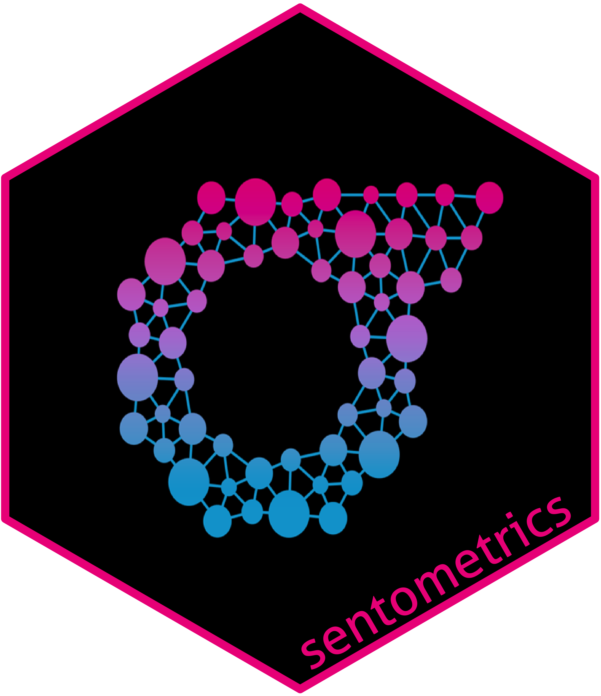

# sentometrics 

<!-- badges: start -->

<!-- badges: end -->

The **`sentometrics`** package offers an integrated framework for textual sentiment time series aggregation and prediction. Explore this package website to learn about what you can do and how so.

### Acknowledgements

This software package originates from a
[Google Summer of Code 2017](https://github.com/rstats-gsoc/gsoc2017/wiki/Sentometrics:-An-integrated-framework-for-text-based-multivariate-time-series-modeling-and-forecasting) project, was further developed 
during a follow-up [Google Summer of Code 2019](https://github.com/rstats-gsoc/gsoc2019/wiki/sentometrics) project, and benefited generally from financial support by [Innoviris](https://innoviris.brussels), [IVADO](https://www.ivado.ca), [swissuniversities](https://www.swissuniversities.ch), and the [Swiss National Science Foundation](http://www.snf.ch) (grants #179281 and #191730).

### Reference

Please cite **`sentometrics`** in publications. See the **Citation** section on the right.

### Contact

Reach out to [Samuel Borms](mailto:borms_sam@hotmail.com) if you have questions, suggestions or want to become a contributor. See the **News > Development** section to find out what you can help us with.

