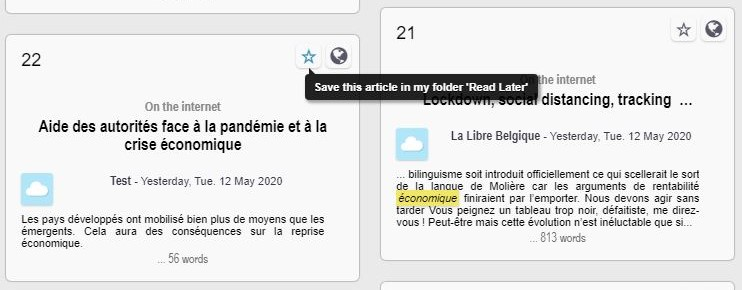
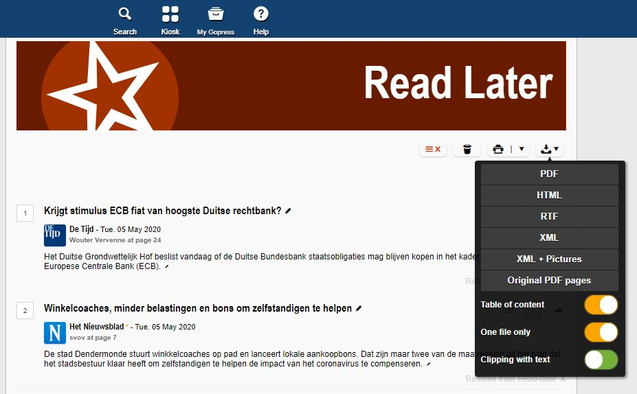

```{r, include=FALSE}
knitr::opts_chunk$set(warning = FALSE, message = FALSE, fig.width = 6, fig.height = 4, fig.align = "center")
```

Tutorial contributed by [Olivier Delmarcelle](mailto:delmarcelle.olivier@gmail.com) (PhD student, Ghent University).

## Introduction

Textual analysis has become very popular nowadays as a tool to extract and derive meaningful information from the enormous amounts of content available online.

Newspapers remain one of the primary sources of information. They have been evolving by extending their offerings online, including the setting up of news archives. That makes it possible to perform wide textual analysis on these archives stored online, for instance, to identify trends across years and newspapers.

With the **Gopress Academic** database, students from various universities in Belgium are able to access news articles from all main Belgian newspapers. These articles are the perfect material for a topic modeling analysis, or textual sentiment computation with the help of the **`sentometrics`** package.

This contributed tutorial describes how to use the **Gopress Academic** database to create a corpus of documents formatted for analysis with **`sentometrics`**. You will learn how to:

* Access and retrieve documents from the **Gopress Academic** database.
* Import the Gopress documents to R and prepare them for a textual analysis.
* Use the **`sentometrics`** package to analyze the corpus of news.

## Obtain data from Gopress

The **Gopress Academic** platform is available [here](https://academic.gopress.be/en). You should be able to register with your university e-mail address to gain access to the database.

After signing in, the Search page appears. In the search tool you can specify the time of publication, the newspaper, and the number of words contained in the articles. A least one keyword should always be used as basis for the search. The returned articles appear at the bottom of the page, with a short extract.

Unfortunately, **Gopress** does not allow downloading in bulk the articles resulting from a search. Instead, one should save articles of interest as "Read Later" by clicking on the star button, as shown below. This should be done for each article of interest.



The saved articles will appear in the "Read Later" section, accessible through the "Read Later" button at the top right of the page. From there, one can download the saved articles in various formats. In this tutorial, we save the articles in RTF format, with one file per article.



## Massage the Gopress data in R

Let's first load all the packages used throughout the tutorial. 

```{r, message=FALSE}
library("sentometrics")
library("data.table")
library("quanteda")
library("stringi")
library("stm")
library("lubridate")
library("striprtf")
```

To easily import the data into R, the downloaded articles should be stored in one single folder, preferably containing only the articles. With the help of the **`striprtf`** package, the articles can then be imported to R.

```{r rtf, message=FALSE}
folder <- "gopress_downloads/" # the folder's path for the downloaded articles
filelist <- list.files(path = folder, pattern = "*rtf")
filelist <- paste(folder, filelist, sep = "")
rawCorpus <- lapply(filelist, FUN = read_rtf)

str(rawCorpus[10:12])
```

The text and metadata in `rawCorpus` are presented as lists of paragraphs, which is inappropriate for most textual analysis packages. The subsequent steps serve to create a corpus object in a full-text format. The first thing to do is to extract the dates and the issuing newspapers from the articles.

```{r date source, message=FALSE}
secpars <- sapply(rawCorpus, "[[", 2) # extract metadata paragraph from all articles

dates <- stri_extract(secpars, regex = "\\d\\d[ ]....[ ]\\d\\d\\d\\d") # extract dates
dates <- as.Date(parse_date_time(dates, "d b y", locale = "English_Belgium.1252")) # reformat dates

sources <- stri_extract(secpars, regex = ".*\\*") # extract newspapers
sources <- stri_replace_all(sources, "", regex = "\\*") # remove asterisks
sources <- stri_replace_all(sources, "_", fixed = "-") # replace "-" with "_"
sources <- iconv(sources, from = "UTF-8", to = "ASCII//TRANSLIT") # remove accents
```

The two vectors `dates` and `sources` now contain properly formatted dates and issuing newspapers. Note that `"-"` and accent characters were removed from the newspaper names because the **`sentometrics`** package does not like these characters when used as feature names.

It is important to emphasize the role of the `locale` argument in the date reformatting. This depends on the language of the **Gopress** website used when downloading the data. We used the English version of the website. For documents downloaded using the Dutch or French version, use `"Dutch_Belgium.1252"` or `"French_Belgium.1252"` instead.

```{r date source2}
table(sources)
```

The next step is to extract the actual body of the articles, found from the fifth paragraph. The fifth paragraph usually contains a small summary of the article's content and may or may not be included. The below code removes the first four paragraphs in all articles.

```{r text, message=FALSE}
texts <- sapply(1:length(rawCorpus), function(i) paste0(rawCorpus[[i]][-c(1:4)], collapse = " "))
```

After the content extraction, time for some text cleaning! We limit ourselves here to the minimum (as we trust in the tokenization done later internally by **`sentometrics`**), but feel free to adjust the cleaning steps to your liking.

```{r text2, message=FALSE}
texts <- stri_trans_tolower(texts)
texts <- stri_replace_all(texts, " ", regex = "\\s+") # shorten sequences of spaces
texts <- stri_trim_both(texts)
```

Lastly, our goal is to create a `data.table` ready to be used within the **`sentometrics`** package. The `sento_corpus()` function takes as argument a `data.frame`-like object with an `"id"` column, a `"texts"` column, a `"date"` column, an optional `"language"` column, and a number of optional numeric columns representing features of the corpus. Therefore, the initiated one-dimensional column `"source"` needs to be transformed to a number of numeric columns.

```{r reshape, message=FALSE}
corpus <- data.table(id = 1:length(dates), date = dates, texts = texts, source = sources, value = 1)
corpus <- dcast(corpus, id + date + texts ~ source, fill = 0) # one column per source
corpus <- corpus[order(date)] # order the corpus by date
```

As the corpus contains newspapers written in Dutch and in French, we also add a `"language"` identifier, which allows to analyze articles in different languages independently.

```{r sento corpus language, message=FALSE}
lng <- ifelse(rowSums(corpus[, c("L'Echo", "Le Soir", "Metro FR")]) == 1, "fr", "nl")
corpus[, language := lng]

str(corpus, give.attr = FALSE)
```

The `corpus` object is now ready to be analyzed!

## Corpus analysis with **`sentometrics`**

The **`sentometrics`** package is a powerful library that allows quickly computing the sentiment of documents within a large corpus. Its sentiment calculation is based on a lexicons approach possibly with valence shifters (to correct for bigrams such as 'not good'). The package also specializes in the creation and analysis of textual sentiment time series.

Let's start using **`sentometrics`** by creating a `sento_corpus` object, the typical ice breaker.

```{r sento corpus, message=FALSE}
sentoCorpus <- sento_corpus(corpus)
sentoCorpus
```

To have a quick understanding of what is inside your corpus, you can call `corpus_summarize()` and then plot one of its outputs.

```{r, message=FALSE}
summ <- corpus_summarize(sentoCorpus, features = c("L'Echo", "Le_Soir", "Metro_FR"))

summ$plots$feature_plot
```

Note how spaces in the feature names were replaced by `"_"`.

The news features can now be used to compute sentiment with the help of the `compute_sentiment()` function and lexicons plugged in. The **`sentometrics`** package has built-in lexicons in English, Dutch and French. The list of available lexicons is accessible through the `list_lexicons` data object. The lexicons to use in the sentiment computation, considering the language, can be prepared as below.

```{r sento sentiment, message=FALSE}
lexicons <- list(
  nl = sento_lexicons(list_lexicons[c("GI_nl_tr", "HENRY_nl_tr", "LM_nl_tr")]),
  fr = sento_lexicons(list_lexicons[c("GI_fr_tr", "HENRY_fr_tr", "LM_fr_tr")])
)

head(lexicons$fr$HENRY_fr_tr)
```

The result of the computation is stored in the object `s`, which contains for every document the sentiment values for each lexicon applied to each feature, resulting in many sentiment vectors.

```{r sento sentiment2, message=FALSE}
s <- compute_sentiment(sentoCorpus, lexicons, how = "counts")

head(s[, 1:5])
```

To present the evolution of sentiment over time, we need aggregation across dates. This is done using the `aggregate()` function, and by specifying beforehand a control object with `ctr_agg()` to define the aggregation specifics. Here, we aggregate by giving more importance to larger documents and creating a 7-day moving average. The `measures` object stores the result of the aggregation.

```{r sento 3, message=FALSE}
ctr <- ctr_agg(howDocs = "proportional", howTime = "equal_weight", by = "day", lag = 7) # control object
measures <- aggregate(s, ctr) # aggregate the sentiment into a sento_measures object

plot(measures, "features")
```

To study the sentiment per language, we can redefine the features based on the existing newspaper features, according to the language of the outlet.

```{r, message=FALSE}
measures <- aggregate(measures, features = list("fr" = c("L'Echo", "Le_Soir", "Metro_FR"), 
                                                "nl" = c("De_Tijd", "De_Morgen", "Metro_NL")))

plot(measures, "features")
```

The tools available in **`sentometrics`** are complementary to other text mining analyses, such as topic modeling. Let's have a look at what a topic model produces for the French subset of our corpus. We create a document-feature (also called document-term) matrix using **`quanteda`**, and fit a topic model with the **`stm`** package.

```{r sento topic, message=FALSE}
frenchCorpus <- corpus_subset(sentoCorpus, language == "fr")

dfm <- dfm(tokens(frenchCorpus), tolower = TRUE) %>% # create & clean a document-feature matrix
  dfm_remove(min_nchar = 3, pattern = stopwords("fr")) %>%
  dfm_trim(min_termfreq = 0.95, termfreq_type = "quantile") %>%
  dfm_trim(max_docfreq = 0.10, docfreq_type = "prop")
dfm <- dfm_subset(dfm, ntoken(dfm) > 0)

topicModel <- stm(dfm, K = 5, verbose = FALSE) # apply a topic model with 5 topics
topTerms <- t(labelTopics(topicModel, n = 10)[["prob"]])

topTerms
```

We can now use the results of this topic model to build new features for our `sentoCorpus` object. The `add_features()` function is used with keywords to automatically assign features to documents. The `keywords` object represents lists of words associated to each topic. Documents receive a score between 0 and 1 based on the frequency of appearance of the keywords for every topic. Notice that we remove the original features at the end.

```{r sento topic 2, message=FALSE}
featuresToRemove <- colnames(docvars(frenchCorpus))[-1] # store the current features to remove

keywords <- lapply(1:ncol(topTerms), function(i) topTerms[, i])
names(keywords) <- paste0("TOPIC_", 1:length(keywords)) # define the feature names
frenchCorpus <- add_features(frenchCorpus, keywords = keywords, do.binary = FALSE, do.regex = FALSE)

docvars(frenchCorpus, featuresToRemove) <- NULL # remove old features

head(docvars(frenchCorpus)) # new features of the corpus
```

Finally, we recompute sentiment based on those new features. This will present how sentiment evolved over time with regards to the different topics extracted. We use the `sento_measures()` function, as it combines `compute_sentiment()` and `aggregate()` straight away. We apply the french lexicons only, and use again the `ctr` object defined earlier.

```{r sento topic 3, message=FALSE}
topicMeasures <- sento_measures(frenchCorpus, lexicons[["fr"]], ctr)

plot(topicMeasures, "features")
```

This is as far as we will go. We covered some functionalities from **`sentometrics`** but there is more to see! Most notably, there is the `sento_model()` function to fit a sentiment-based high-dimensional regression. It is also possible to use more complex weighting schemes and valence-enhanced lexicons in the sentiment calculation.

You can find more examples and information about the **`sentometrics`** package in the **Examples** section of this website, and in the package's [vignette](https://papers.ssrn.com/sol3/papers.cfm?abstract_id=3067734).

#### Acknowledgements

Thanks to Eline Vandewalle for writing early versions of some of the code examples, and to Samuel Borms for going over the tutorial. Thanks to the Belga News Agency for maintaining the **Gopress** database, and to Innoviris for the financial support under the Team Up and Launch programs.

