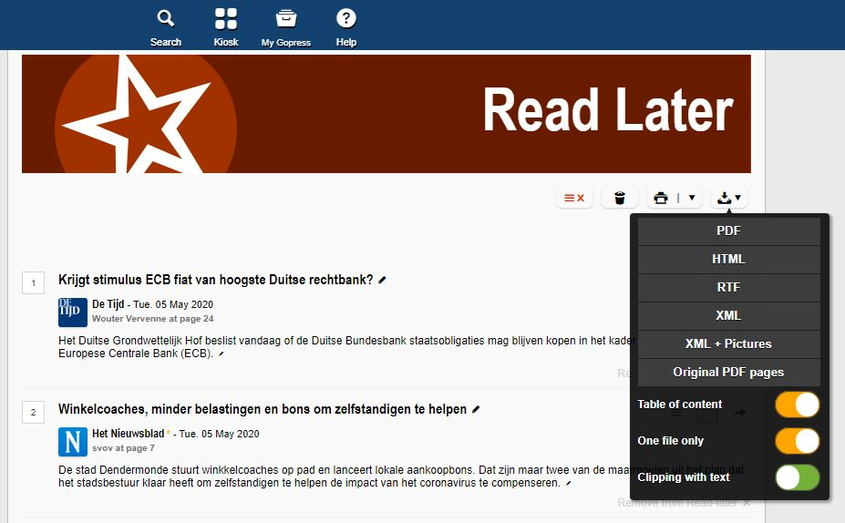

```{r, include=FALSE}
knitr::opts_chunk$set(warning = FALSE, message = FALSE, fig.width = 6, fig.height = 4, fig.align = "center")
```

Tutorial contributed by [Olivier Delmarcelle](delmarcelle.olivier@gmail.com) (PhD student, Ghent University).

## Introduction

Textual analysis has become more and more popular nowadays as a tool to extract and derive meaningful information from the enormous amount of content available online.

Printed newspapers used to be one of the primary sources of information. As they evolved by extending their offer through online services and subscription, newspapers remain today an important information media. Even more interesting, it is now possible to perform wide textual analysis on these online versions, identifying trends across years and newspapers.

Thanks to **Gopress Academic**, students from various universities in Belgium are able to access a large database containing news articles from the main Belgian newspaper. These articles are the perfect material for textual analysis, such as a sentiment computation with the help of the **`sentometrics`** package.

This contributed tutorial describes how to make use of the database of **Gopress Academic**, which contains news articles from the main Belgian newspapers, in order to create a corpus of documents formatted for analysis through the **`sentometrics`** package.

In this small tutorial, you will learn how to:

* Access and retrieve documents from the **Gopress Academic** database.
* Import the Gopress documents to R and prepare them for a textual analysis.
* Use the **`sentometrics`** package to calculate and analyze sentiment from a corpus of documents.

## Obtain data from Gopress

The Gopress Academic platform is available [here](https://academic.gopress.be/en). You should be able to register with your university e-mail address to gain access to the database.

After signing in, the Search page should appear and allow search across the database. The search tool allows to specify the time of publication, the newspaper, and the number of words contained in the articles. A least one keyword should always be used as a basis for the search. The results of the search appear at the bottom of the page. Returned articles will show up with a short extract.

Unfortunately, Gopress does not allow downloading in bulk the articles resulting from a search. Instead, the easiest method is to save articles of interest in "Read Later" by clicking on the star button, as shown in the following screenshot. This should be done for each article of interest.  
  


The saved articles will appear in the "Read Later" section, accessible through the "Read Later" button at the top right of the page. From there, it is possible to download the set of saved articles in various formats, as shown in the following screenshot. For the purpose of this guide, we will only make use of articles saved in the RTF format, with one different file for each article. 



## Massage the Gopress data in R

To easily import the data to R, the downloaded articles should be stored in one single folder, preferably containing only the articles.

With the help of the **`striprtf`** package, articles can be imported to R.

```{r rtf, message=FALSE}
library("striprtf")

folder <- "gopress_downloads/" # the folder's path for the downloaded articles
filelist <- list.files(path = folder, pattern = "*rtf")
filelist <- paste(folder, filelist, sep = "")
rawCorpus <- lapply(filelist, FUN = read_rtf)

str(rawCorpus, list.len = 3)
```

Note that the documents in `rawCorpus` are presented as lists of paragraphs, which is inappropriate for most textual analysis packages. The subsequent steps serve to create a corpus object in a full-text format. The first thing to do is to extract the dates and the issuing newspapers from the articles (as in `rawCorpus`, everything is concatenated).

```{r date source, message=FALSE}
library("stringi")
library("lubridate")

secpars <- sapply(rawCorpus, "[[", 2) # extract second paragraphs from all articles

# extract dates
dates <- stri_extract(secpars, regex = "\\d\\d[ ]....[ ]\\d\\d\\d\\d") # extract dates
dates <- as.Date(parse_date_time(dates, "d b y", locale = "English_Belgium.1252")) # reformat dates

# extract newspapers
sources <- stri_extract(secpars, regex = ".*\\*") # extract the newspaper name
sources <- stri_extract(sources, regex = "[^[\\*]]*") # remove asterisks
sources <- gsub("-", "_", sources) # "-" causes issues so replace with "_"
sources <- iconv(sources, from = "UTF-8", to = "ASCII//TRANSLIT") # remove accents
```

The two vectors `dates` and `sources` now contain properly formatted dates and issuing newspapers. Note that `"-"` and accent characters were removed from the newspapers names as the **`sentometrics`** package does not support these characters in the feature names.

It is important to emphasize the role of the locale for date conversion, which depends on the language of the Gopress website used when downloading the data. The assumption here is that the English version of the website was used. For documents downloaded using the Dutch or French version of the website, use `"Dutch_Belgium.1252"` or `"French_Belgium.1252"` instead.

```{r date source2}
head(table(dates))
table(sources)
```

The next step is to extract the content of articles, found from the fifth paragraph. The fifth paragraph usually contains a small summary of the article's content and may or may not be included. The below code removes the first four paragraphs of all articles.

```{r text, message=FALSE}
texts <- sapply(1:length(rawCorpus), function(i) paste(unlist(rawCorpus[[i]][-c(1:4)]), collapse = " "))
```

It is also a good moment to do some text cleaning!

```{r text2, message=FALSE}
library("tm")

# some text cleaning, feel free to adjust...
texts <- stri_trans_tolower(texts)
texts <- tm::removeNumbers(texts)
texts <- tm::removePunctuation(texts)
texts <- gsub("[^[:alnum:]]", " ", texts)
texts <- tm::stripWhitespace(texts)
texts <- stri_trim_both(texts)
```

Lastly, our goal is to create a `data.table` ready to be used within the **`sentometrics`** package. The `sento_corpus()` function takes as argument a `data.frame` type object with an `"id"` column, a `"texts"` column, a `"date"` column, and a number of optional numeric columns representing features of the corpus. Therefore, there is a need to transform the one-dimensional column `"source"` to a number of numeric columns. This can be done using the **`reshape`** package.

```{r reshape, message=FALSE}
library("reshape")
library("data.table")

id <- 1:length(dates) # create an id column
corpus <- data.table(date = dates, source = sources, id = id, value = 1) # initialize a corpus data.table
corpus <- as.data.table(reshape::cast(corpus, date + id ~ source, fill = 0)) # one column per source

# create a temporary data.table to store texts in the correct order and then merge on common ids
idTexts <- data.table(id, texts)
corpus <- merge(corpus, idTexts, by = "id")
```

As the corpus contains newspapers written in Dutch and in French, it would be interesting to have a feature that denotes the newspaper language. Adding a `"language"` feature allows to analyze articles in different languages independently.

```{r sento corpus language, message=FALSE}
lng <- ifelse(rowSums(corpus[, c("L'Echo", "Le Soir", "Metro FR")]) == 1, "fr", "nl")
corpus <- cbind(corpus, language = lng)
```

```{r, message=FALSE}
str(corpus, give.attr = FALSE)
```

The `corpus` object is now ready for use!

## Corpus analysis with **`sentometrics`**

The **`sentometrics`** package is a powerful package that allows to quickly compute the sentiments of a corpus of documents. It includes the use of lexicons, valences shifters (to correctly compute bigrams such as 'not good') and permits the creation of time series of sentiments.

Let's start using **`sentometrics`**  in our example by creating a `sento_corpus` object, the main object on which most methods of the package are applied. Note how spaces in feature names were replaced by the character `"_"` in the `sentoCorpus` object.

```{r sento corpus, message=FALSE}
library("sentometrics")

corpus <- corpus[order(date)] # order the corpus by date first
sentoCorpus <- sento_corpus(corpus)

summary <- corpus_summarize(sentoCorpus,  features = c("L'Echo", "Le_Soir", "Metro_FR")) # summarize corpus

summary$plots$feature_plot # present the frequencies for the features selected above
```

The news features can now be used to compute sentiment with the help of the `compute_sentiment()` function and using a lexicon. **`sentometrics`** already provides built-in lexicons in English, Dutch and French. The list of available lexicons is accessible through the `list_lexicons` data object. A list of lexicons for the sentiment computation, considering the language, can be prepared as below.

```{r sento sentiment, message=FALSE}
lexicons <- list(
  nl = sento_lexicons(list_lexicons[c("GI_nl_tr", "HENRY_nl_tr", "LM_nl_tr")]),
  fr = sento_lexicons(list_lexicons[c("GI_fr_tr", "HENRY_fr_tr", "LM_fr_tr")])
)

head(lexicons$fr$HENRY_fr_tr)
```

The result of the computation is stored in the object `s`, which contains a document's sentiment values for each lexicon applied on each feature, resulting in many sentiment vectors.

```{r sento sentiment2, message=FALSE}
s <- compute_sentiment(sentoCorpus, lexicons, how = "counts")

head(s[, 1:5])
```

In order to present the evolution of sentiment over time, the previous calculation needs to be aggregated by the dates. This is done using the `aggregate()` function, and by specifying beforehand a control object for the aggregation with `ctr_agg()`. The following code aggregates by giving more importance to larger documents and creates a moving average accros a period of 7 days. The `measures` object stores the result of the aggregation, and a `plot()` method is defined for it.

```{r sento 3, message=FALSE}
ctr <- ctr_agg(howDocs = "proportional", howTime = "equal_weight", by = "day", lag = 7) # control object
measures <- aggregate(s, ctr) # aggregate the sentiment into a sento_measures object

plot(measures, "features") # by newspapers
```

To study the sentiment per language, we can redefine the features based on the existing newspaper features, according to the language of the outlet.

```{r, message=FALSE}
measures <- aggregate(measures, features = list("fr" = c("L'Echo", "Le_Soir", "Metro_FR"), 
                                                "nl" = c("De_Tijd", "De_Morgen", "Metro_NL")))

plot(measures, "features") # by language
```

The tools available through **`sentometrics`** can as well be complementary to other analyses, such as topic model analyses. Let's have a look at what a topic model procudes for the french part of our dataset, creating a document-feature matrix using **`quanteda`** methods and using a model from the **`stm`** package.

```{r sento topic, message=FALSE}
library("quanteda")
library("stm")

frenchCorpus <- corpus_subset(sentoCorpus, language == "fr") # easy subsetting using the language feature

# create and clean a document-feature matrix
dfm <- dfm(frenchCorpus, tolower = TRUE, remove_punct = TRUE, remove_numbers = TRUE, 
           remove = c(stopwords("fr"), stopwords("nl"))) %>%
  dfm_remove(min_nchar = 3) %>%
  dfm_trim(min_termfreq = 0.95, termfreq_type = "quantile") %>%
  dfm_trim(max_docfreq = 0.10, docfreq_type = "prop")
dfm <- dfm_subset(dfm, ntoken(dfm) > 0)

# apply a topic model with 5 topics
topicModel <- stm::stm(dfm, K = 5, verbose = FALSE)
topTerms <- t(stm::labelTopics(topicModel, n = 10)[["prob"]])

topTerms
```

We can now use the result of this topic model to build new features to analyse for our `sentoCorpus` object. This time, the `add_features()` function will be used with keywords to automatically assign features to documents. The `keywords` object represent lists of words associated to each topics. Documents will receive a score between 0 and 1 based on the frequencies of the document's words for each topic. At the end of the process, the new features will behave similarly to the previous ones. Notice that old features were removed by setting them to `NULL`.

```{r sento topic 2, message=FALSE}
keywords <- lapply(1:ncol(topTerms), function(i) topTerms[, i]) # build the keywords object
names(keywords) <- paste0("TOPIC_", 1:length(keywords)) # define the feature names

featuresToRemove <- names(docvars(frenchCorpus))[-1] # store the current features that will be removed

# add features based on the appearence of the topic keywords within documents, and remove old features
frenchCorpus <- add_features(frenchCorpus, keywords = keywords, do.binary = FALSE, do.regex = FALSE)
docvars(frenchCorpus, featuresToRemove) <- NULL

head(docvars(frenchCorpus)) # new features of the corpus
```

Finally, we can once again compute sentiments based on those new features. This will present how sentiment evolved over time, with regard to the different topics of the model. However, we're going to use a slightly different method to obtain a time series of the sentiment values by using the `sento_measures()` function. This function effectively combines `compute_sentiment()` and `aggregate()` and returns a `sento_measures` object as output. We define a new `sento_lexicons` object containing the french lexicons, and since we already defined the `ctr` object earlier, we can simply use it again.

```{r sento topic 3, message=FALSE}
frenchLexicons <- lexicons[["fr"]]
topicMeasures <- sento_measures(frenchCorpus, frenchLexicons, ctr)

plot(topicMeasures, "features")
```

This is as far as we will go. We covered some functionalities from **`sentometrics`** but there is more to see! Notably, the `sento_model()` function which can be used to model a sentiment-based regression. It is also possible to use more complex weighting schemes and valence-enhanced lexicons.

You can find more examples and information about the **`sentometrics`** package on the [website](https://sborms.github.io/sentometrics/index.html) and in the package's [vignette](https://papers.ssrn.com/sol3/papers.cfm?abstract_id=3067734).

#### Acknowledgements

Thanks to Eline Vandewalle for writing early versions of some of the code examples. Thanks to the Belga News Agency for providing us with the Gopress database, and to Innoviris for the financial support under the Team Up and Launch programs.

